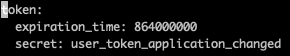
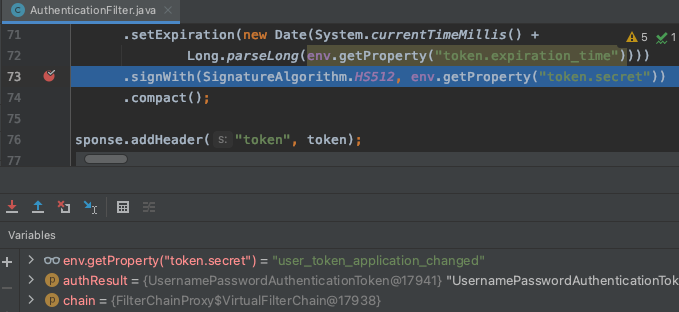
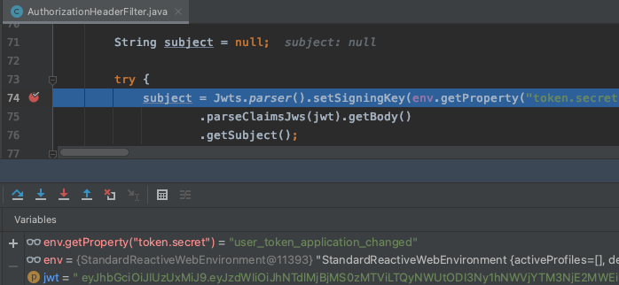
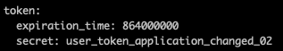
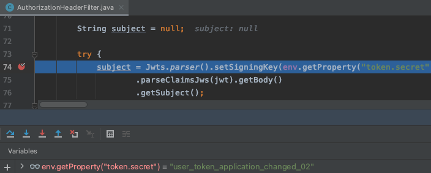
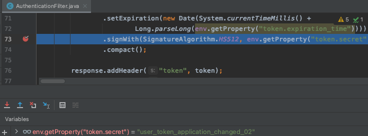
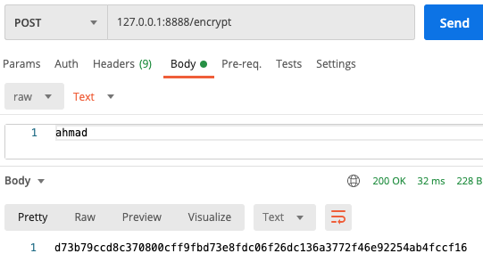
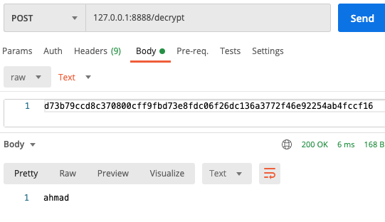

 

# Spring Cloud Config
 

## 로컬에 git 저장소 만들어서 테스트 
로컬에 git 저장소를 만든 후 공통으로 쓸 yml 설정 파일을 추가한다.  
~~~
$ mkdir git-local-repo
$ git init .
$ vim ecommerce.yml 
    (아래 내용 추가) 
    ----------------------------
    token:
      expiration_time: 864000000
      secret: user_token
    
    gateway:
      ip: [게이트웨이 아이피]
    ----------------------------
$ git add ecommerce.yml
$ git commit -m 'upload an application  yml file'
~~~

그리고 config-service에 아래와 같이 설정한다.  
#### [application.yml]
~~~
server:
  port: 8888

spring:
  application:
    name: config-service
  cloud:
    config:
      server:
        git:
          uri: file:///Users/sombrero104/workspace/git-local-repo
~~~
#### [App.java]
~~~
@SpringBootApplication
@EnableConfigServer
public class App {
    ...
}
~~~

 

config-service를 실행한 후 아래 경로로 접속을 하면  
http://127.0.0.1:8888/ecommerce/default  
아래와 같이 저장소에 추가했던 설정 파일 정보를 확인할 수 있다.  

 
  

## user-service 에 연동 

#### [pom.xml]
~~~
<dependency>
    <groupId>org.springframework.cloud</groupId>
    <artifactId>spring-cloud-starter-config</artifactId>
</dependency>
<dependency>
    <groupId>org.springframework.cloud</groupId>
    <artifactId>spring-cloud-starter-bootstrap</artifactId>
</dependency>
~~~

#### [bootstrap.yml]
~~~
spring:
  cloud:
    config:
      uri: http://127.0.0.1:8888
      name: ecommerce
~~~

#### [실행 결과 Bootstrap 로그]
 

#### [실행 결과 Config 정보 확인]
 
  

## Configuration 갱신 방법
- 서버 재기동 
- Spring Boot Actuator refresh 
    - 재기동 없이 갱신 가능 
    - Application 상태, 모니터링 
    - Metric 수집을 위한 Http End point 제공 
    - user-service에 Spring Boot Actuator 의존성 추가  
    #### [user-service - pom.xml]
    ~~~
    <dependency>
        <groupId>org.springframework.boot</groupId>
        <artifactId>spring-boot-starter-actuator</artifactId>
    </dependency>
    ~~~
    #### [user-service - application.yml]
    ~~~
      management:
        endpoints:
          web:
            exposure:
              include: refresh, health, beans, busrefresh, info, metrics, prometheus
    ~~~
    테스트를 하기 위해 공통으로 사용하는 ecommerce.yml 파일을 수정한 후  
    git-local-repo 로컬 리파지토리에 커밋한다.  
    그리고 http://127.0.0.1:8000/user-service/actuator/refresh (POST) 로 요청을 보내면  
    아래와 같이 응답으로 어떤 내용이 변경되었는지 확인할 수 있으며,  
    
     
    
    user-service 를 재기동하지 않아도 해당 변경 내용이 반영된 것을 확인할 수 있다.  
    
     
    
    하지만 서비스 마다 refresh 를 호출해줘야 하는 번거로움이 있다.  
    
- Spring Cloud Bus 사용 (위 Actuator 보다 효율적)  
    - 분산 시스템의 노드를 경량 메시지 브로커와 연결
    - 상태 및 구성에 대한 변경 사항을 연결된 노드에게 전달(Broadcast)
    - Spring Cloud Bus 에 연결되어 있기만 하면 어떤 서비스라도 /busrefresh (POST) 를 호출할 경우  
        Spring Cloud Bus 에 연결되어 있는 다른 서비스에도 모두 업데이트가 된다.  
    - RabbitMQ 설치   
    https://www.rabbitmq.com/install-homebrew.html   
    ~~~
    $ brew list  
    $ brew update
    $ brew install rabbitmq
    ~~~
    ~~~
    ...
    Management Plugin enabled by default at http://localhost:15672
    
    Bash completion has been installed to:
      /usr/local/etc/bash_completion.d
    
    To restart rabbitmq after an upgrade:
      brew services restart rabbitmq
    Or, if you don't want/need a background service you can just run:
      CONF_ENV_FILE="/usr/local/etc/rabbitmq/rabbitmq-env.conf" /usr/local/opt/rabbitmq/sbin/rabbitmq-server
    ==> Summary
    🍺  /usr/local/Cellar/rabbitmq/3.10.6: 1,399 files, 30.6MB
    ==> Running `brew cleanup rabbitmq`...
    Disable this behaviour by setting HOMEBREW_NO_INSTALL_CLEANUP.
    Hide these hints with HOMEBREW_NO_ENV_HINTS (see `man brew`).
    ==> Caveats
    ==> rabbitmq
    Management Plugin enabled by default at http://localhost:15672
    
    Bash completion has been installed to:
      /usr/local/etc/bash_completion.d
    
    To restart rabbitmq after an upgrade:
      brew services restart rabbitmq
    Or, if you don't want/need a background service you can just run:
      CONF_ENV_FILE="/usr/local/etc/rabbitmq/rabbitmq-env.conf" /usr/local/opt/rabbitmq/sbin/rabbitmq-server
    ~~~
    ~~~
    $ export PATH=$PATH:/usr/local/sbin
    혹은 .bash_profile의 PATH에 '/usr/local/sbin' 추가 후 적용. (source .bash_profile)
    rabbitmq-server 명령으로 실행. 
    ~~~
    RabbitMQ 관리자 접속 http://127.0.0.1:15672 (guest/guest)   
    - AMQP 사용   
    #### [config-service, user-service, gateway-service - pom.xml]
    ~~~
    <dependency>
      <groupId>org.springframework.boot</groupId>
      <artifactId>spring-boot-starter-actuator</artifactId>
    </dependency>
    <dependency>
      <groupId>org.springframework.cloud</groupId>
      <artifactId>spring-cloud-starter-bus-amqp</artifactId>
    </dependency>
    ~~~
    #### [config-service, user-service, gateway-service - application.yml]
    ~~~
    spring:
      rabbitmq:
        host: 127.0.0.1
        port: 5672
        username: guest
        password: guest
  
    management:
      endpoints:
        web:
          exposure:
            include: refresh, health, beans, httptrace, busrefresh, info, metrics, prometheus
    ~~~
    #### [토큰 시크릿 값 변경 후 user-service 에서 busrefresh 호출 결과]
     
    
     
    
     
    
     
    
    #### [토큰 시크릿 값 변경 후 gateway-service 에서 busrefresh 호출 결과]
     
        
     
    
     
    
     
    
 

> #### AMQP (Advanced Message Queuing Protocol)
> - 메시지 지향 미들웨어를 위한 개방형 표준 응용 계층 프로토콜
> - 메시지 지향, 큐잉, 라우팅(P2P, Publisher-Subscriber), 신뢰성, 보안
> - Erlang, RebbitMQ 에서 사용

> #### Kafka 프로젝트
> - Apache Software Foundation 이 Scalar 언어로 개발한 오픈 소스 메시지 브로커 프로젝트
> - 분산형 스트리밍 플랫폼
> - 대용량의 데이터를 처리 가능한 메시징 시스템 

> #### RabbitMQ vs Kafka
> - RabbitMQ (좀 더 적은 데이터를 안전하게 전달 보장)
>   - 메시지 브로커 
>   - 초당 20+ 메시지를 소비자에게 전달
>   - 메시지 전달 보장, 시스템 간 메시지 전달
>   - 브로커, 소비자 중심 
> - Kafka (대용량 데이터를 빠른 시간에 처리)
>   - 초당 100k+ 이상의 이벤트 처리
>   - Pub/Sub, Topic 에 메시지 전달
>   - Ack를 기다리지 않고 전달 가능
>   - 생산자 중심 
> 
> https://www.confluent.io/blog/kafka-fastest-messaging-system/  

  

## 프로파일 적용
ecommerce.yml 파일을 프로파일을 다르게 하여 새로 추가한다.  
> 테스트를 위해서 임시로 프로파일을 다르게(시크릿 값을 다르게) 설정했는데  
> 요청으로 받은 JWT 토큰으로 gateway-service 에서 인가(Authorization)를 하고  
> user-service 에서 인증(Authentication)을 하고 있기 때문에  
> 인가/인증이 필요한 user-service API 를 사용하기 위해서는  
> gateway-service 와 user-service 의 시크릿 값이 같도록 같은 프로파일을 사용해야 한다.  

 

#### [gateway-service]
 

 

#### [user-service]

 

 
  

## 깃헙 원격 저장소 사용 시 
~~~
spring:
  application:
    name: config-service
  cloud:
    config:
      server:
        git:
#          uri: file:///Users/sombrero104/workspace/git-local-repo
          uri: https://github.com/sombrero104/springcloud-config.git
#          username:
#          password:
~~~
  

## Configuration 암호화 
- Symmetric Encryption (Shared)
    - Using the same key
- Asymmetric Encryption (RSA Keypair)
    - Private and Public Key
    - Using Java keytool
    
### Symmetric Encryption (대칭 암호화)
#### [pom.xml]
~~~
<!-- bootstrap 의존성을 추가해야 bootstrap.yml 설정 파일을 읽어온다. -->
<dependency>
    <groupId>org.springframework.cloud</groupId>
    <artifactId>spring-cloud-starter-bootstrap</artifactId>
</dependency>
~~~
#### [bootstrap.yml]
~~~
encrypt:
  key: abcdefghijklmnopqrstuvwxyz0123456789
~~~
#### [암호화]
http://127.0.0.1:8888/encrypt (POST)  

 
#### [복호화]
http://127.0.0.1:8888/decrypt (POST)  

 

    

